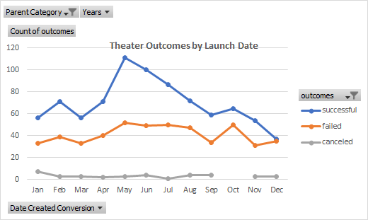

# Kickstarting with Excel
## Overview of the project 
### Purpose
This project was to Analyze data from **Kickstarter** data to see how results for other campaigns based upon pulling data to see **Outcomes Based on Launch Date and Outcomes based on goals**. When trying to analyze the results for **Outcomes Based on Launch Date**; we are looking to see if it makes a difference for a Kickstarter campaign of theater projects are launched at a specific month or it can be launched at any time and get the same results. The second analysis, **Outcomes Based on Goals**, was to see if the monetary goal for the campaign effected if the campaign was successful, failed, or canceled.
## Analysis and Challenges

### Analysis of Outcomes Based on Launch Date
The **Outcomes Based on Launch Date** showed us the outcomes of different campaigns based upon the month. It showed us the three different results of theater campaigns successful, failed, or canceled. Looking at the line graph below we can see that there are specific months that a Kickstarter should begin because of the higher number of successes. It also shows us that there are times when a Kickstarter campaign will most likely be unsuccessful. This gives us a better understanding when is the right time to launch a Kickstarter campaign.

### Analysis of Outcomes Based on Goals
The second analysis that was charted was **Outcomes based on Goals**. For this analysis it was to see if the goal amount of each Kickstarter campaign had an effect on if the campaign was successful or not. The line graph below shows the different ranges of the goals and the percentage of campaigns that were successful, failed, or cancelled. This will allow us to suggest based on the goals of the campaign if there is a higher chance to fail or succeed, or even be cancelled.

### Challenges and Difficulties Encountered
There were challenges through the process of setting the data that had occurred for me personally.One of those challenges was the pivot table for outcomes by launch date was grouping my dates by year automatically. So, I had the help of my TA Derek and he helped me come to realize that I had to ungroup my rows so I can see the months breakdown. Also, my countifs formula took some time for me because it was very meticulous and had to make sure every argument was correct. The biggest difficulty I encountered was my readme. To make sure that the pictures/screenshots were properly linking with my resources page. Also, each answer is properly being entered in the correct section with the help of Derek and Mayur helping to figure out how to fix the problems I was having.
## Results
### What are two conclusions you can draw about the Outcomes based on Launch Date?
- The **Outcomes Based on Launch Date** showed us that time when a campaign is launched can affect the outcome of it. When looking and the line chart you can see that campaigns that are started in May has the highest number of successful Kickstarters. Also, it showed that if a Kickstarter campaign was launched in December there was close to a 50% chance that would fail. If Louise were to start another Kickstarter campaign, I would advise her to launch it in May it looks like that if is more likely to succeed. Also, I would advise her to not launch it in December for there is close to a 50% chance that it may be unsuccessful.
### What can you conclude about the Outcomes based on Goals?
- The **Outcomes based on Goals** line graph shows that there is a relationship between the percentage of Kickstarter campaigns that succeed and fail. Looking at the line graph the higher the goal is the high the percentage that the campaign will fail at reaching its goal. Looking at the graph once the goal of the play is over 14999 the percentage of it to fail increases, while the percentage of it to succeed drops. So, if there were a recommendation based on this graph to limit the goal to under 14999. This would have a better chance of succeeding.
### What are some limitations of this dataset?
- As all data there in limitations in datasets. This dataset also has limitations, such as **Outcomes Based on Launch Date**. The data is limited because it shows data for all theatrical campaigns; so it is not specific to if it is a play, musical, etc. Also, it shows all plays in every country so if you are creating a play in the US it might not want to see campaigns that are started in different countries. **Outcomes based on Goals** shows us blocks of ranges that may not pertain to the campaign that is going to be started, such as big set productions that will cost more than just funding for a play. So, you may want to learn more specific goal amounts rather than looking at the whole sample. Limitations also can be that since it is a sample size there may be times when the graph may show something that occurred in this sample, but not the total population. Also, when the campaign was made something in 2009 may not have the same success in 2020.
### What are some other possible tables and/or graphs that we could create?
- Some other possibility in tables could be the outcomes based on country, if you are creating a campaign for a play in the US you can create a table or graph on campaigns, specifically in the US. Also, you can create a table/or graph based on outcomes on the subcategory to see if there is a better chance of a campaign being successful as a play vs a musical. You can see create a graph to see how many backers and average donations plays will receive to see what goal is reachable and what is not. 
